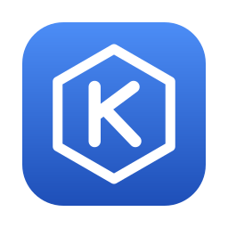

# Kubar

<p align="center">
  
</p>

<p align="center">Your Kubernetes cluster in the macOS menu <b>bar</b>.</p>

- Switch kubeconfig contexts and check the connection
- Nodes with readiness and CPU/memory usage
- Browse namespaces, deployments and pods
- Restart deployments, delete deployments and pods

## Open in Xcode

Open `Kubar.xcodeproj`, then run the `Kubar` target.

The app uses SwiftUI's `MenuBarExtra` and sets `LSUIElement=YES`, so it appears in the macOS menu bar without a Dock icon.

## Command line

`kubar` is a cross-platform CLI (macOS, Linux, Windows) built on the same `KubarCore` package. It needs `kubectl` on PATH.

```sh
swift run kubar                                # status + nodes for the current context
swift run kubar contexts
swift run kubar namespaces
swift run kubar deployments -n <namespace>
swift run kubar pods -n <namespace> [-d <deployment>]
swift run kubar -c <context> -w nodes          # pick a context, refresh every 10s
```

Run `swift test` to test the core.

## Windows tray app

`KubarTray` adds Kubar to the Windows notification area, built on `KubarCore` and Win32. Left-click the icon for a
popup with the same things as the macOS app (context, nodes with usage, namespace → deployment → pods, restart and
delete with confirmation; double-click a node for `kubectl describe`). Drag its header to move it and its edges to
resize it; it reopens where you left it. Right-click for Refresh and Quit. Build it with the Swift toolchain for Windows
(`winget install Swift.Toolchain`) in a Developer PowerShell for Visual Studio, so `link.exe` and the Windows SDK are found:

```powershell
swift build -c release
.build\release\KubarTray.exe
```

It needs the Swift runtime DLLs: install the Swift runtime, or copy them next to `KubarTray.exe`.

Windows 11 24H2 or later runs kubectl without a console window (`AllocConsoleWithOptions`); on earlier
versions a console may flash once at startup.

## Contributing

This project does not accept pull requests. Send a patch instead; see [CONTRIBUTING.md](CONTRIBUTING.md).

## License

[MIT](LICENSE). Kubar runs the separately installed `kubectl` (Apache-2.0) as an external program and does not include or redistribute any of its code.
